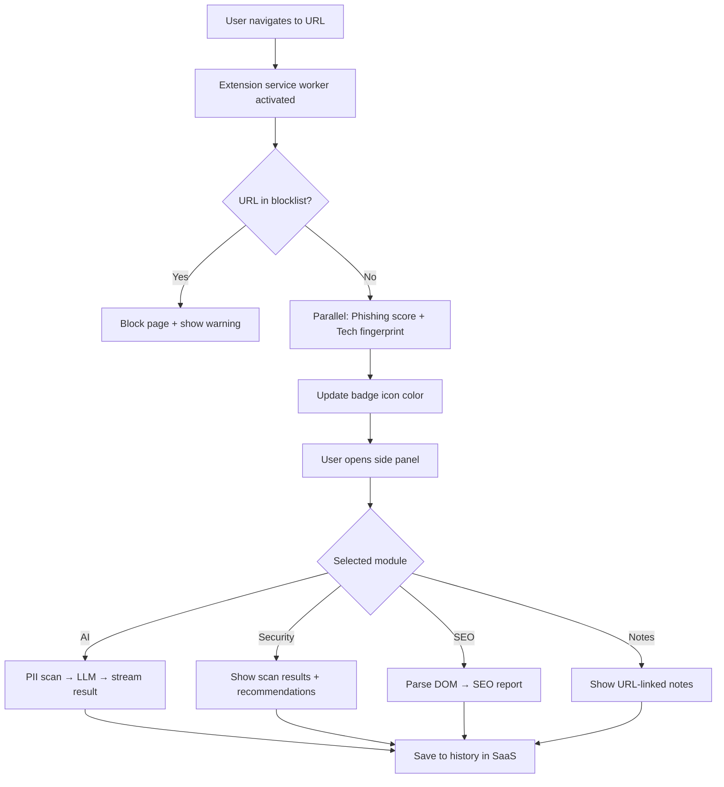
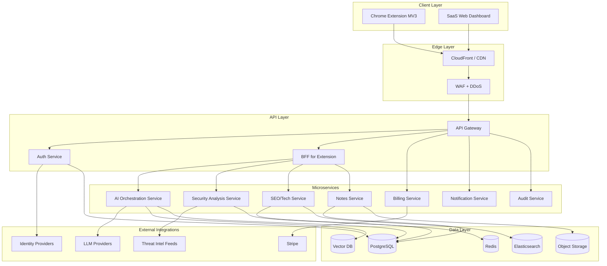

# TechShield AI — Enterprise Product Specification

**Version:** 1.0  
**Status:** Draft — Pre-Development  
**Last Updated:** June 15, 2026  
**Document Owner:** Product & Architecture  
**Classification:** Internal — Confidential

---

## Table of Contents

1. [Executive Summary](#1-executive-summary)
2. [Product Requirement Document (PRD)](#2-product-requirement-document-prd)
3. [User Personas](#3-user-personas)
4. [User Stories](#4-user-stories)
5. [Customer Journey](#5-customer-journey)
6. [UX Flow](#6-ux-flow)
7. [Feature Hierarchy](#7-feature-hierarchy)
8. [System Architecture](#8-system-architecture)
9. [Security Architecture](#9-security-architecture)
10. [Monetization Model](#10-monetization-model)
11. [SaaS Architecture](#11-saas-architecture)
12. [Scalability Strategy](#12-scalability-strategy)
13. [API Architecture](#13-api-architecture)
14. [Database Planning](#14-database-planning)
15. [Technical Roadmap](#15-technical-roadmap)
16. [MVP Features](#16-mvp-features)
17. [Future Features](#17-future-features)
18. [Risks and Solutions](#18-risks-and-solutions)

---

## 1. Executive Summary

**TechShield AI** is an enterprise-grade AI-powered Chrome extension paired with a cloud SaaS platform that unifies content creation, productivity, and web security into a single workspace embedded in the browser.

### Vision

Empower knowledge workers, security teams, marketers, and developers to create better content, work more productively, and browse the web safely — without context-switching across dozens of tools.

### Problem Statement

Modern professionals use fragmented tools for AI writing, SEO analysis, security scanning, note-taking, and productivity. Security tooling is often separate from daily workflows, leading to delayed threat response and poor adoption. Generic AI tools lack domain-aware security and compliance controls required by enterprises.

### Solution

A Manifest V3 Chrome extension (primary UX surface) backed by a multi-tenant SaaS platform providing:

| Module | Purpose |
|--------|---------|
| AI Prompt Generator | Structured prompt creation with templates |
| AI Prompt Enhancer | Context-aware prompt optimization |
| AI Content Generator | Long/short-form content with brand voice |
| Website Security Scanner | Passive & active security assessment |
| Phishing Detector | Real-time URL/page threat scoring |
| Malware Detection | File/hash/URL malware intelligence |
| SEO Analyzer | On-page and technical SEO insights |
| Website Technology Detector | Stack fingerprinting (Wappalyzer-class) |
| Notes Manager | Context-linked notes tied to URLs/projects |
| Productivity Toolkit | Focus timers, snippets, task capture |

### Success Metrics (12-Month Targets)

| Metric | Target |
|--------|--------|
| Monthly Active Users (MAU) | 250,000 |
| Enterprise accounts | 500 |
| Free → Paid conversion | 8% |
| Net Revenue Retention (NRR) | 115% |
| Mean Time to Detect Phishing (MTTD) | < 2 seconds |
| Platform uptime SLA | 99.9% |
| NPS (Enterprise) | ≥ 45 |

---

## 2. Product Requirement Document (PRD)

### 2.1 Product Goals

1. **Unified workflow** — One extension for AI, security, SEO, and productivity on any webpage.
2. **Enterprise readiness** — SSO, RBAC, audit logs, data residency, DLP from day one of GA.
3. **Security-first AI** — No training on customer data by default; PII redaction before LLM calls.
4. **Low-latency edge UX** — Extension responds in < 500ms for local checks; cloud for heavy analysis.
5. **Monetizable depth** — Clear free/pro/enterprise tiers with API and team features.

### 2.2 Non-Goals (v1)

- Native mobile apps (responsive web dashboard only)
- Self-hosted on-prem deployment (roadmap item, not MVP)
- Full SIEM replacement
- Browser support beyond Chrome/Edge (Chromium) at launch

### 2.3 Target Market

| Segment | Size Estimate | Primary Need |
|---------|---------------|--------------|
| SMB marketing teams | 2M+ globally | AI content + SEO |
| Mid-market IT/security | 500K orgs | Phishing/malware + policy |
| Enterprise security & GRC | 50K orgs | Compliance, SSO, audit |
| Freelancers & creators | 10M+ | Prompt tools + notes |
| DevOps / web agencies | 1M+ | Tech stack + security scans |

### 2.4 Functional Requirements

#### FR-1: Authentication & Identity

| ID | Requirement | Priority |
|----|-------------|----------|
| FR-1.1 | Email/password + OAuth (Google, Microsoft) signup | P0 |
| FR-1.2 | SAML 2.0 / OIDC SSO for Enterprise | P0 (Enterprise) |
| FR-1.3 | MFA (TOTP, WebAuthn) | P0 |
| FR-1.4 | Organization + workspace model with invite flows | P0 |
| FR-1.5 | Role-based access control (Owner, Admin, Member, Viewer) | P0 |

#### FR-2: Chrome Extension Core

| ID | Requirement | Priority |
|----|-------------|----------|
| FR-2.1 | Manifest V3 compliant service worker architecture | P0 |
| FR-2.2 | Side panel + popup + context menu integration | P0 |
| FR-2.3 | Offline-capable notes and cached scan history | P1 |
| FR-2.4 | Per-site permissions with user consent | P0 |
| FR-2.5 | Extension ↔ SaaS sync via secure WebSocket + REST | P0 |

#### FR-3: AI Modules

| ID | Requirement | Priority |
|----|-------------|----------|
| FR-3.1 | Prompt templates by use case (marketing, code, security) | P0 |
| FR-3.2 | Prompt enhancer with tone, audience, length controls | P0 |
| FR-3.3 | Content generator with streaming output | P0 |
| FR-3.4 | Brand voice profiles per organization | P1 |
| FR-3.5 | PII detection and redaction before LLM submission | P0 |
| FR-3.6 | Model routing (fast vs. quality) with cost caps | P1 |

#### FR-4: Security Modules

| ID | Requirement | Priority |
|----|-------------|----------|
| FR-4.1 | Real-time phishing score for active tab URL | P0 |
| FR-4.2 | Visual phishing indicators (badge, overlay warnings) | P0 |
| FR-4.3 | Malware hash/URL lookup via threat intelligence feeds | P0 |
| FR-4.4 | Website security scanner (headers, SSL, mixed content) | P0 |
| FR-4.5 | Scheduled deep scans via SaaS dashboard | P1 |
| FR-4.6 | Admin blocklist/allowlist policies | P0 (Enterprise) |

#### FR-5: SEO & Technology

| ID | Requirement | Priority |
|----|-------------|----------|
| FR-5.1 | On-page SEO audit (title, meta, headings, schema) | P0 |
| FR-5.2 | Core Web Vitals signal capture where permitted | P1 |
| FR-5.3 | Technology stack detection on current page | P0 |
| FR-5.4 | Exportable SEO/tech reports (PDF, CSV) | P1 |

#### FR-6: Notes & Productivity

| ID | Requirement | Priority |
|----|-------------|----------|
| FR-6.1 | URL-anchored notes with tags and search | P0 |
| FR-6.2 | Snippet library with shortcuts | P1 |
| FR-6.3 | Quick task capture with due dates | P1 |
| FR-6.4 | Pomodoro/focus timer | P2 |

#### FR-7: SaaS Dashboard

| ID | Requirement | Priority |
|----|-------------|----------|
| FR-7.1 | Team management, billing, usage analytics | P0 |
| FR-7.2 | Scan history, AI usage logs, audit trail | P0 |
| FR-7.3 | API key management for integrations | P1 |
| FR-7.4 | Webhook notifications for security events | P1 |

### 2.5 Non-Functional Requirements

| Category | Requirement |
|----------|-------------|
| Performance | Extension UI render < 200ms; API p95 < 300ms (read), < 2s (AI) |
| Availability | 99.9% uptime; multi-region active-active |
| Security | SOC 2 Type II path; encryption at rest (AES-256) and in transit (TLS 1.3) |
| Privacy | GDPR, CCPA compliant; data deletion within 30 days of request |
| Scalability | 1M concurrent extension heartbeats; 10K RPS API burst |
| Accessibility | WCAG 2.1 AA for dashboard and extension UI |
| Localization | English (v1); i18n framework for ES, DE, FR (v2) |

### 2.6 Compliance & Legal

- Terms of Service, Privacy Policy, DPA for enterprise
- Acceptable Use Policy for AI and scanning features
- Explicit consent for page content analysis
- Responsible disclosure program for security module findings
- Copyright considerations for AI-generated content disclaimers

---

## 3. User Personas

### Persona 1: Sarah Chen — Marketing Manager (Pro User)

| Attribute | Detail |
|-----------|--------|
| Age | 34 |
| Role | Head of Content, mid-market SaaS |
| Goals | Ship SEO-optimized content faster; audit competitor pages |
| Pain Points | Juggling ChatGPT, SEMrush, and spreadsheets; inconsistent brand voice |
| Tech Savvy | Medium |
| Willingness to Pay | $29–49/user/month from team budget |
| Key Features | Content Generator, SEO Analyzer, Prompt Enhancer, Notes |

**Quote:** *"I need AI that knows our brand and tells me why a page ranks — while I'm already on that page."*

---

### Persona 2: Marcus Webb — Security Analyst (Enterprise)

| Attribute | Detail |
|-----------|--------|
| Age | 41 |
| Role | SOC Tier 2, financial services |
| Goals | Reduce phishing incidents; enforce safe browsing policy |
| Pain Points | Users click links before tickets are filed; no visibility on browser activity |
| Tech Savvy | High |
| Willingness to Pay | Enterprise contract $15K–100K/year |
| Key Features | Phishing Detector, Malware Detection, Admin policies, Audit logs |

**Quote:** *"If we can warn users at click-time in the browser, we stop half our incidents before they start."*

---

### Persona 3: Alex Rivera — Freelance Developer (Free → Pro)

| Attribute | Detail |
|-----------|--------|
| Age | 28 |
| Role | Full-stack freelancer |
| Goals | Quick tech stack discovery; security sanity checks for client sites |
| Pain Points | Too many browser extensions; subscription fatigue |
| Tech Savvy | Very high |
| Willingness to Pay | $12/month individual |
| Key Features | Tech Detector, Security Scanner, Prompt Generator, Snippets |

**Quote:** *"I just want to open a site and instantly know what it's built with and if anything looks sketchy."*

---

### Persona 4: Priya Nair — IT Administrator (Enterprise Buyer)

| Attribute | Detail |
|-----------|--------|
| Age | 38 |
| Role | IT Director, 500-employee healthcare org |
| Goals | Centralized provisioning, SSO, compliance reporting |
| Pain Points | Shadow IT extensions; HIPAA concerns with AI tools |
| Tech Savvy | High |
| Willingness to Pay | Budget holder; needs ROI and compliance packet |
| Key Features | SSO, RBAC, DLP, usage reports, allowlist/blocklist |

**Quote:** *"I won't approve another AI tool unless it integrates with Okta and doesn't store PHI."*

---

### Persona 5: Jordan Kim — Productivity-Focused Knowledge Worker

| Attribute | Detail |
|-----------|--------|
| Age | 31 |
| Role | UX Researcher |
| Goals | Capture insights while browsing; structured research notes |
| Pain Points | Notes scattered across Notion, bookmarks, and screenshots |
| Tech Savvy | Medium |
| Willingness to Pay | Bundled in team plan |
| Key Features | Notes Manager, Productivity Toolkit, Prompt Generator |

**Quote:** *"Every tab is research. I need notes that remember which URL they came from."*

---

## 4. User Stories

### Epic: Onboarding & Account

| ID | Story | Acceptance Criteria |
|----|-------|-------------------|
| US-001 | As a new user, I want to sign up with Google so that I can start in under 60 seconds | OAuth flow works; extension auto-pairs on login |
| US-002 | As an admin, I want to invite team members by email so that I can provision seats | Invite email sent; role assigned on accept |
| US-003 | As an enterprise admin, I want SSO via Okta so that I enforce corporate identity | SAML/OIDC login; JIT provisioning optional |

### Epic: AI Prompt Generator

| ID | Story | Acceptance Criteria |
|----|-------|-------------------|
| US-010 | As a marketer, I want prompt templates by campaign type so that I get consistent outputs | ≥ 20 templates; customizable variables |
| US-011 | As a user, I want to save custom prompts so that I can reuse them | Saved to library; syncs across devices |
| US-012 | As a security-conscious user, I want PII stripped from prompts so that sensitive data isn't sent to AI | PII detected; user notified; redaction log |

### Epic: AI Prompt Enhancer

| ID | Story | Acceptance Criteria |
|----|-------|-------------------|
| US-020 | As a user, I want to paste a rough prompt and get an improved version so that I get better AI results | Enhancer returns structured prompt; tone options |
| US-021 | As a user, I want to see before/after diff so that I learn prompt engineering | Side-by-side comparison UI |

### Epic: AI Content Generator

| ID | Story | Acceptance Criteria |
|----|-------|-------------------|
| US-030 | As a content writer, I want streaming blog drafts so that I can iterate quickly | Token streaming in extension; stop/regenerate |
| US-031 | As a team lead, I want brand voice profiles so that output matches our style | Org-level voice config applied to generation |

### Epic: Website Security Scanner

| ID | Story | Acceptance Criteria |
|----|-------|-------------------|
| US-040 | As a developer, I want an instant security header check on the current page so that I spot misconfigurations | CSP, HSTS, X-Frame-Options reported |
| US-041 | As a user, I want a numeric security score so that I can compare sites | 0–100 score with breakdown |
| US-042 | As an admin, I want scheduled scans of our domains so that I get alerts on regressions | Cron scans; email/webhook alerts |

### Epic: Phishing Detector

| ID | Story | Acceptance Criteria |
|----|-------|-------------------|
| US-050 | As any user, I want a warning before I enter credentials on a suspicious site so that I avoid phishing | High-risk sites show blocking interstitial |
| US-051 | As a SOC analyst, I want phishing alerts in the dashboard so that I can investigate | Event logged with URL, score, user, timestamp |

### Epic: Malware Detection

| ID | Story | Acceptance Criteria |
|----|-------|-------------------|
| US-060 | As a user, I want downloaded files checked against threat feeds so that I don't open malware | Download hook (where permitted); hash lookup |
| US-061 | As a user, I want malicious URLs blocked so that I'm protected from drive-by downloads | URL blocklist sync; real-time check |

### Epic: SEO Analyzer

| ID | Story | Acceptance Criteria |
|----|-------|-------------------|
| US-070 | As an SEO specialist, I want on-page element analysis so that I can optimize without leaving the page | Title, meta, H1-H6, alt text, canonical |
| US-071 | As a user, I want actionable recommendations ranked by impact so that I know what to fix first | Prioritized issue list |

### Epic: Website Technology Detector

| ID | Story | Acceptance Criteria |
|----|-------|-------------------|
| US-080 | As a developer, I want to see frameworks and analytics on a page so that I understand the stack | Categories: CMS, JS libs, analytics, CDN |
| US-081 | As a sales rep, I want to export tech profiles so that I can enrich leads | CSV/JSON export |

### Epic: Notes Manager

| ID | Story | Acceptance Criteria |
|----|-------|-------------------|
| US-090 | As a researcher, I want notes tied to URLs so that context is never lost | Auto-attach URL; full-text search |
| US-091 | As a user, I want offline note access so that I can work without connectivity | Local IndexedDB sync |

### Epic: Productivity Toolkit

| ID | Story | Acceptance Criteria |
|----|-------|-------------------|
| US-100 | As a user, I want text snippets with shortcuts so that I type less | `;;` trigger; sync across devices |
| US-101 | As a user, I want a focus timer so that I manage deep work | Pomodoro with notifications |

### Epic: Administration & Billing

| ID | Story | Acceptance Criteria |
|----|-------|-------------------|
| US-110 | As an admin, I want usage dashboards so that I understand AI and scan consumption | Per-user and org-level metrics |
| US-111 | As a finance user, I want Stripe invoicing so that I can pay annually | Plans, seats, proration |

---

## 5. Customer Journey

### 5.1 Journey Map — Individual User (Free → Pro)

```
Awareness → Consideration → Activation → Habit → Conversion → Advocacy
```

| Stage | Touchpoints | User Actions | Emotions | Opportunities |
|-------|-------------|--------------|----------|---------------|
| **Awareness** | Chrome Web Store, blog, Twitter/X, Product Hunt | Sees "AI + Security in one extension" | Curious, skeptical | Clear value prop video |
| **Consideration** | Landing page, reviews, comparison pages | Compares vs. separate tools | Evaluating ROI | Free tier, no credit card |
| **Activation** | Install extension, create account | Runs first SEO scan + prompt | Delighted if < 30s | Guided onboarding checklist |
| **Habit** | Daily browse, notes, AI drafts | Uses 3+ modules/week | Dependent | Weekly tips, streaks |
| **Conversion** | Hit AI quota, export limit | Upgrades to Pro | Invested | In-extension upgrade CTA |
| **Advocacy** | Team invite, social share | Refers colleagues | Proud | Referral credits |

### 5.2 Journey Map — Enterprise Buyer

| Stage | Key Activities | Stakeholders | Deliverables |
|-------|----------------|--------------|--------------|
| **Problem recognition** | Phishing incident or AI governance gap | CISO, IT | Internal risk memo |
| **Vendor discovery** | RFP, Gartner, peer referral | Procurement, Security | Vendor shortlist |
| **Evaluation** | POC with 50-seat pilot | SOC, IT Admin | POC success criteria doc |
| **Security review** | Questionnaire, pen test report | Security, Legal | SOC 2, DPA, architecture diagram |
| **Purchase** | Annual contract, SSO setup | Finance, IT | Order form, SOW |
| **Rollout** | MDM/extension force-install | IT | Deployment guide |
| **Expansion** | More seats, API integration | Champions | QBR, usage reports |

### 5.3 Critical Moments of Truth

1. **First scan in < 5 seconds** after install — determines retention
2. **First phishing warning** — establishes trust in security module
3. **First AI output quality** — determines Pro conversion
4. **SSO first login (Enterprise)** — determines rollout success

---

## 6. UX Flow

### 6.1 Information Architecture

```
TechShield AI
├── Extension (Side Panel)
│   ├── Home (unified dashboard for current tab)
│   ├── AI Studio
│   │   ├── Prompt Generator
│   │   ├── Prompt Enhancer
│   │   └── Content Generator
│   ├── Security
│   │   ├── Phishing Check
│   │   ├── Malware Status
│   │   └── Security Scan
│   ├── Insights
│   │   ├── SEO Analyzer
│   │   └── Tech Detector
│   ├── Workspace
│   │   ├── Notes
│   │   └── Productivity
│   └── Settings (account, permissions, theme)
└── SaaS Web App
    ├── Dashboard (org overview)
    ├── Team & Roles
    ├── Security Center (policies, events)
    ├── AI Usage & Brand Voices
    ├── Reports & Exports
    ├── Billing
    ├── API Keys & Webhooks
    └── Audit Log
```

### 6.2 Primary Flow: Tab-Aware Security + AI



### 6.3 Onboarding Flow (First Run)

1. Install from Chrome Web Store
2. Welcome screen → explain permissions (activeTab, storage, alarms)
3. Create account or sign in (OAuth)
4. Pair extension with account (device token)
5. Interactive tour: "Scan this page" → "Try a prompt" → "Save a note"
6. Optional: pin extension, open side panel
7. Checklist completion → unlock bonus AI credits

### 6.4 Enterprise Admin Flow

1. Sign up → create organization
2. Connect SSO (SAML metadata upload)
3. Configure security policies (block/allow lists, sensitivity threshold)
4. Invite users or enable SCIM provisioning
5. Deploy extension via Chrome Enterprise policy
6. Monitor dashboard → audit log review

### 6.5 UX Principles

- **Context-first:** Every feature defaults to the active tab's URL and content
- **Progressive disclosure:** Simple score on badge; details in panel
- **Non-blocking security:** Warn, don't annoy; tunable sensitivity
- **Consistent design system:** Shared tokens between extension and web app
- **Keyboard-first:** Power users can trigger any module via shortcuts

---

## 7. Feature Hierarchy

### 7.1 MoSCoW Prioritization

| Priority | Features |
|----------|----------|
| **Must Have (MVP)** | Auth, extension shell, Prompt Generator, Phishing Detector, Security Scanner (basic), SEO Analyzer (basic), Tech Detector, Notes (basic), SaaS dashboard (usage + billing) |
| **Should Have (v1.1)** | Prompt Enhancer, Content Generator, Malware Detection, brand voice, scheduled scans, webhooks |
| **Could Have (v1.2)** | Productivity toolkit, API public beta, SCIM, advanced SEO |
| **Won't Have (v1)** | Mobile app, on-prem, white-label |

### 7.2 Feature Tier Matrix

| Feature | Free | Pro | Team | Enterprise |
|---------|------|-----|------|------------|
| Prompt Generator | 10/day | Unlimited | Unlimited | Unlimited |
| Content Generator | — | 100K tokens/mo | Pooled | Custom |
| Phishing Detector | Basic | Full + history | Team policies | Global policies |
| Security Scanner | 5/day | Unlimited | Scheduled | API + bulk |
| SEO Analyzer | Basic | Full | Reports | White-glove |
| Tech Detector | ✓ | ✓ + export | ✓ | API |
| Notes | 50 notes | Unlimited | Shared notebooks | Compliance hold |
| SSO | — | — | — | ✓ |
| Audit log | — | — | 30 days | 1 year+ |

### 7.3 Module Dependency Graph

```
                    ┌─────────────┐
                    │ Auth / Org  │
                    └──────┬──────┘
           ┌───────────────┼───────────────┐
           ▼               ▼               ▼
    ┌────────────┐  ┌────────────┐  ┌────────────┐
    │ AI Gateway │  │ Threat Intel│  │ Page Parser│
    └─────┬──────┘  └─────┬──────┘  └─────┬──────┘
          │               │               │
    ┌─────┴─────┐   ┌─────┴─────┐   ┌─────┴─────┐
    │ Prompt/   │   │ Phishing/ │   │ SEO/Tech  │
    │ Content   │   │ Malware   │   │ Analyzer  │
    └───────────┘   └───────────┘   └───────────┘
          │               │               │
          └───────────────┼───────────────┘
                          ▼
                   ┌────────────┐
                   │ Notes /    │
                   │ Productivity│
                   └────────────┘
```

---

## 8. System Architecture

### 8.1 High-Level Architecture



### 8.2 Chrome Extension Architecture (MV3)

| Component | Responsibility |
|-----------|----------------|
| **Service Worker** | Event routing, background sync, alarm-based heartbeat |
| **Content Scripts** | DOM parsing (SEO), page metadata extraction (lightweight) |
| **Side Panel UI** | React/Vue SPA — module interfaces |
| **Popup** | Quick status badge, phishing score, shortcuts |
| **Offscreen Document** | Heavy DOM work if needed (MV3 constraint) |
| **Local Storage** | IndexedDB for offline notes, cache, queue |

**Communication pattern:** Extension → HTTPS REST + WebSocket to BFF; local rules cache refreshed every 15 minutes.

### 8.3 Backend Service Boundaries

| Service | Owns | Tech Suggestion |
|---------|------|-----------------|
| Auth Service | Users, orgs, SSO, MFA, sessions | Node.js / Go |
| AI Orchestration | Prompt pipelines, model routing, PII redaction | Python / Node |
| Security Analysis | Phishing ML, scans, threat intel fusion | Go / Python |
| SEO/Tech Service | DOM analysis rules, tech signatures DB | Node.js |
| Notes Service | CRUD, sync, search | Node.js |
| Billing Service | Stripe sync, entitlements, quotas | Node.js |
| Audit Service | Immutable event log | Go |
| Notification Service | Email, webhooks, in-app | Node.js |

### 8.4 AI Orchestration Pipeline

```
User Input → PII Scanner → Policy Check → Prompt Assembler → Model Router
    → LLM API → Output Filter → Stream to Client → Usage Meter → Audit Log
```

**Model routing logic:**
- Fast/cheap model for enhancer and short prompts
- Quality model for long-form content
- Enterprise: optional Azure OpenAI / private endpoint

### 8.5 Deployment Model

| Environment | Purpose |
|-------------|---------|
| Development | Local docker-compose + extension sideload |
| Staging | Full mirror, synthetic data |
| Production | Multi-region (us-east-1, eu-west-1) |

**Infrastructure:** Kubernetes (EKS/GKE) or managed containers (ECS), Terraform IaC, GitOps (ArgoCD).

---

## 9. Security Architecture

### 9.1 Security Principles

1. **Zero trust** — Every request authenticated and authorized
2. **Least privilege** — Extension permissions minimized (activeTab preferred)
3. **Defense in depth** — WAF, mTLS internal, secrets in Vault
4. **Secure by default** — MFA encouraged, PII redaction on, no training on customer data
5. **Transparency** — Audit logs for all admin and AI operations

### 9.2 Threat Model (STRIDE Summary)

| Threat | Mitigation |
|--------|------------|
| **Spoofing** | JWT with short TTL, refresh rotation, SSO |
| **Tampering** | Signed extension updates, HMAC webhooks, immutable audit |
| **Repudiation** | Centralized audit log with retention policies |
| **Information disclosure** | Encryption, tenant isolation, field-level encryption for secrets |
| **Denial of service** | Rate limiting, WAF, per-tenant quotas |
| **Elevation of privilege** | RBAC, policy engine, admin action MFA step-up |

### 9.3 Extension Security

- **Code integrity:** Chrome Web Store signing; optional enterprise CRX packaging
- **Permission model:** Request `activeTab` not `<all_urls>` where possible
- **CSP:** Strict content security policy in extension pages
- **Secret storage:** No API keys in extension; OAuth device flow + short-lived tokens
- **Update channel:** Stable/beta channels; kill switch for compromised versions

### 9.4 Data Classification & Handling

| Class | Examples | Storage | Retention |
|-------|----------|---------|-----------|
| Public | Marketing content | CDN | Indefinite |
| Internal | Aggregated analytics | PG/ES | 2 years |
| Confidential | User notes, prompts | PG encrypted | User-controlled |
| Restricted | SSO certs, API keys | Vault/KMS | Rotation policy |
| PHI/PCI | Not in scope v1 | Prohibited | N/A |

### 9.5 AI-Specific Security

- PII detection (regex + NER model) before outbound LLM calls
- Prompt injection defenses in system prompts and output validation
- No customer content used for model fine-tuning without explicit opt-in
- Enterprise: data residency region lock; Azure OpenAI private deployment option
- Content safety filter on outputs (toxicity, malware code generation block)

### 9.6 Security Scanning Ethics & Legal

- Passive analysis by default (headers, DOM, SSL cert)
- Active scanning only on user-initiated or owned domains with consent
- Respect `robots.txt` for crawler-based scheduled scans
- Rate limit scans to prevent abuse as DDoS vector
- Clear disclaimer: not a replacement for professional pentest

### 9.7 Compliance Roadmap

| Framework | Target |
|-----------|--------|
| SOC 2 Type II | Month 12 post-launch |
| GDPR | Launch |
| CCPA | Launch |
| ISO 27001 | Year 2 |
| HIPAA BAA | Enterprise add-on Year 2 |

---

## 10. Monetization Model

### 10.1 Pricing Tiers

| Tier | Price | Target | Key Limits |
|------|-------|--------|------------|
| **Free** | $0 | Individuals, trial | 10 AI prompts/day, basic security, 5 scans/day |
| **Pro** | $19/mo ($15 annual) | Power users | Unlimited prompts, 100K AI tokens, full security |
| **Team** | $39/user/mo (min 5) | SMB teams | Pooled tokens, shared notes, team policies |
| **Enterprise** | Custom ($25K+ ARR) | Large orgs | SSO, SCIM, audit, SLA, dedicated support |

### 10.2 Revenue Streams

1. **Subscription (primary)** — 85% of revenue target
2. **API overage** — Usage-based pricing above included quotas
3. **Enterprise add-ons** — Advanced threat feeds, custom model routing, premium support
4. **Marketplace (future)** — Third-party prompt packs and scan plugins (30% take rate)

### 10.3 Unit Economics (Target at Scale)

| Metric | Target |
|--------|--------|
| ARPU (blended) | $14/mo |
| CAC (Pro) | < $45 |
| LTV:CAC | > 3:1 |
| Gross margin | 75%+ (after LLM + infra) |
| Payback period | < 6 months |

### 10.4 Billing Architecture

- Stripe Billing for subscriptions, invoicing, tax (Stripe Tax)
- Entitlement service syncs plan features in real-time
- Usage metering for AI tokens, API calls, scheduled scans
- Self-serve upgrade/downgrade with proration

---

## 11. SaaS Architecture

### 11.1 Multi-Tenancy Model

**Hybrid approach:** Shared application layer with **logical tenant isolation** (org_id on every row) + **optional dedicated resources for Enterprise**.

| Layer | Tenancy |
|-------|---------|
| Application | Shared pods, tenant context in JWT |
| Database | Shared PG with Row-Level Security (RLS) |
| Cache | Redis key prefix per org |
| Search | ES index per org or filtered aliases |
| AI usage | Per-org quota counters in Redis |
| Enterprise | Dedicated namespace, optional single-tenant DB |

### 11.2 Tenant Lifecycle

```
Signup → Trial (14 days Pro) → Active → Upgrade/Downgrade → Churn → Data retention → Deletion
```

### 11.3 Entitlement & Feature Flags

- **Entitlement service:** Source of truth for plan limits
- **Feature flags (LaunchDarkly/Unleash):** Gradual rollouts, kill switches
- Extension checks entitlements on sync heartbeat (every 5 min)

### 11.4 SaaS Dashboard Modules

| Module | Function |
|--------|----------|
| Overview | Active users, threat blocks, AI usage |
| Team | Invite, roles, deactivate |
| Security Center | Policies, events, threat map |
| AI Studio Admin | Brand voices, model policies, blocked topics |
| Reports | Exportable compliance and usage reports |
| Integrations | API keys, webhooks, SIEM forward |
| Billing | Plan, invoices, payment method |

### 11.5 White-Label / MSP (Future)

- Custom domain for dashboard
- Logo/colors per org
- MSP parent-child org hierarchy

---

## 12. Scalability Strategy

### 12.1 Traffic Profile Estimates (Year 1)

| Workload | Peak Volume |
|----------|-------------|
| Extension heartbeats | 500K / 5 min |
| Phishing URL checks | 50K RPS |
| AI generation requests | 2K concurrent streams |
| SEO/tech page parses | 10K / min |
| Dashboard API | 5K RPS |

### 12.2 Scaling Patterns

| Component | Strategy |
|-----------|----------|
| API Gateway | Horizontal auto-scale, regional |
| Stateless services | HPA on CPU/RPS |
| AI service | Queue-based (SQS/RabbitMQ) + worker pool; backpressure |
| Phishing checks | Redis cache (URL hash → score, TTL 1h) + read replicas |
| Database | PG primary + read replicas; connection pooling (PgBouncer) |
| Search | ES data tiers, index lifecycle management |
| Extension rules | CDN edge cache for blocklists |

### 12.3 Caching Strategy

| Data | Cache | TTL |
|------|-------|-----|
| Threat intel lookups | Redis | 1–24 hours |
| Tech signatures | In-memory + Redis | 24 hours |
| User entitlements | Redis | 5 minutes |
| SEO rules/templates | CDN | 1 hour |

### 12.4 Resilience

- Multi-AZ deployment minimum
- Active-active multi-region for API (Route 53 latency routing)
- Circuit breakers for LLM and threat intel providers
- Graceful degradation: extension uses local cache if API unavailable
- RPO < 1 hour, RTO < 4 hours

### 12.5 Cost Optimization

- LLM token budgeting per tier; smaller models for classification
- Spot instances for batch scan workers
- S3 lifecycle for old reports
- Reserved capacity for baseline load

---

## 13. API Architecture

### 13.1 API Design Standards

- **REST** for CRUD and resource operations
- **WebSocket** for AI streaming and real-time security alerts
- **OpenAPI 3.1** specification published
- **Versioning:** URL prefix `/v1/`; 12-month deprecation policy
- **Auth:** Bearer JWT (user) or API key (server-to-server)
- **Rate limits:** Per-key and per-org; `429` with `Retry-After`

### 13.2 Core API Domains

```
/v1/auth/*           — Login, refresh, SSO callback
/v1/orgs/*           — Organization management
/v1/users/*          — User profile, preferences
/v1/ai/prompts/*     — Prompt generator, enhancer
/v1/ai/content/*     — Content generation (streaming)
/v1/security/scan/*  — Website security scans
/v1/security/phishing/* — URL check
/v1/security/malware/*  — Hash/URL lookup
/v1/seo/*            — SEO analysis
/v1/tech/*           — Technology detection
/v1/notes/*          — Notes CRUD, sync
/v1/billing/*        — Subscription, usage
/v1/audit/*          — Audit log query
/v1/webhooks/*       — Webhook management
```

### 13.3 Example: Phishing Check API

```
POST /v1/security/phishing/check
Authorization: Bearer <token>

Request:
{
  "url": "https://example.com/login",
  "context": {
    "referrer": "https://email-link.com",
    "page_title": "Sign in"
  }
}

Response:
{
  "url": "https://example.com/login",
  "risk_score": 87,
  "risk_level": "high",
  "signals": [
    { "type": "typosquat", "detail": "Domain similar to known brand" },
    { "type": "new_domain", "detail": "Registered 2 days ago" }
  ],
  "action": "warn",
  "checked_at": "2026-06-15T10:30:00Z"
}
```

### 13.4 WebSocket Events

| Event | Direction | Purpose |
|-------|-----------|---------|
| `ai.stream.token` | Server → Client | Streaming AI output |
| `security.alert` | Server → Client | Real-time threat notification |
| `policy.update` | Server → Client | Blocklist/entitlement change |
| `sync.notes` | Bidirectional | Note sync |

### 13.5 API Gateway Features

- JWT validation, API key validation
- Request/response logging (PII scrubbed)
- Rate limiting, IP allowlisting (Enterprise)
- Request size limits (1MB default; 10MB for uploads)
- mTLS option for Enterprise API

### 13.6 SDK & Integration

- JavaScript/TypeScript SDK (extension + Node)
- Python SDK for security automation
- Zapier/Make connectors (v1.2)
- SIEM export: CEF/JSON syslog, Splunk HEC

---

## 14. Database Planning

### 14.1 Database Technology Selection

| Store | Use Case | Justification |
|-------|----------|---------------|
| **PostgreSQL 16** | Primary OLTP | ACID, RLS, JSONB, mature |
| **Redis 7** | Cache, rate limits, sessions | Speed, pub/sub |
| **Elasticsearch 8** | Audit search, SEO reports | Full-text, aggregations |
| **S3** | Reports, exports, attachments | Cheap blob storage |
| **Pinecone/pgvector** | Prompt templates, semantic search | Vector similarity |

### 14.2 Core Entity Relationship (Conceptual)

```
organizations ─┬─< users (via memberships)
               ├─< subscriptions
               ├─< brand_voices
               ├─< security_policies
               └─< api_keys

users ─┬─< notes
       ├─< prompts (saved)
       ├─< ai_usage_logs
       └─< devices (extension instances)

security_events ──> organizations, users
scan_results ──> organizations, users, urls(url_cache)
seo_reports ──> organizations, users
tech_profiles ──> url_cache
audit_logs ──> organizations (immutable)
```

### 14.3 Key Tables (Summary)

| Table | Purpose | Est. Row Growth |
|-------|---------|-----------------|
| `organizations` | Tenant root | 100K Y1 |
| `users` | User accounts | 500K Y1 |
| `memberships` | User-org-role | 600K Y1 |
| `notes` | User notes | 5M Y1 |
| `ai_usage_logs` | Token metering | 50M Y1 |
| `security_events` | Phishing/malware events | 20M Y1 |
| `scan_results` | Security scan outputs | 10M Y1 |
| `seo_reports` | SEO analysis results | 8M Y1 |
| `tech_profiles` | Stack detections | 15M Y1 |
| `audit_logs` | Compliance audit | 100M Y1 |
| `url_threat_cache` | Cached threat scores | 50M (rolling) |

### 14.4 Indexing Strategy

- Composite indexes on `(org_id, created_at DESC)` for tenant-scoped queries
- Partial indexes for active subscriptions, unresolved security events
- BRIN on `audit_logs.created_at` for time-series
- GIN on JSONB columns for scan findings

### 14.5 Data Partitioning & Archival

- `audit_logs`: partition by month; archive to S3 after 90 days (Enterprise: 1 year hot)
- `ai_usage_logs`: partition by week; aggregate then purge raw after 90 days
- `url_threat_cache`: TTL-based eviction in Redis; PG backup for analytics

### 14.6 Row-Level Security (PostgreSQL)

```sql
-- Example RLS policy pattern
ALTER TABLE notes ENABLE ROW LEVEL SECURITY;
CREATE POLICY notes_org_isolation ON notes
  USING (org_id = current_setting('app.current_org_id')::uuid);
```

### 14.7 Backup & DR

- PG: continuous WAL archiving, daily snapshots, 35-day retention
- Cross-region replica for DR
- Quarterly restore drills

---

## 15. Technical Roadmap

### Phase 0: Foundation (Weeks 1–4)

- Monorepo setup, CI/CD, environments
- Auth service (email + Google OAuth)
- Extension shell (MV3 service worker + side panel)
- API gateway, basic BFF
- PostgreSQL schema v1, Redis

### Phase 1: MVP Core (Weeks 5–10)

- Prompt Generator + basic AI gateway
- Phishing Detector (rule + feed based)
- Security Scanner (passive headers/SSL)
- SEO Analyzer (on-page basics)
- Tech Detector (signature DB)
- Notes (URL-linked, sync)
- SaaS dashboard (auth, billing Stripe, usage)
- Chrome Web Store beta submission

### Phase 2: Growth (Weeks 11–16)

- Prompt Enhancer + Content Generator (streaming)
- Malware Detection module
- Team plans, shared notes
- Webhooks, email alerts
- SOC 2 controls implementation begins
- Public launch

### Phase 3: Enterprise (Weeks 17–24)

- SAML/OIDC SSO, MFA enforcement
- Admin security policies, audit log UI
- SCIM provisioning
- Scheduled scans, API v1 public
- Multi-region deployment
- Enterprise sales enablement

### Phase 4: Scale & Expand (Months 7–12)

- Productivity Toolkit
- Advanced SEO (CWV, backlinks estimate)
- MSP/white-label exploration
- Marketplace beta
- ISO 27001 prep
- Edge caching for global latency

---

## 16. MVP Features

### 16.1 MVP Scope Definition

**Goal:** Validate core value — unified AI + security on any webpage — with paying individual users within 10 weeks.

### 16.2 MVP Feature List

| # | Feature | MVP Scope | Out of MVP |
|---|---------|-----------|------------|
| 1 | Chrome Extension MV3 | Side panel, popup, badge | Firefox, Safari |
| 2 | Auth | Email, Google OAuth, JWT | SAML SSO |
| 3 | AI Prompt Generator | 15 templates, save prompts | Brand voice |
| 4 | Phishing Detector | URL scoring, badge warning | ML model v2 |
| 5 | Security Scanner | Headers, SSL, mixed content | Active crawl |
| 6 | SEO Analyzer | Title, meta, headings, images | CWV |
| 7 | Tech Detector | Top 500 signatures | Full Wappalyzer parity |
| 8 | Notes Manager | Create, tag, URL-link, search | Shared notebooks |
| 9 | SaaS Dashboard | Profile, usage, Stripe Pro plan | Team admin |
| 10 | Billing | Free + Pro via Stripe | Team/Enterprise |

### 16.3 MVP Technical Stack (Recommended)

| Layer | Technology |
|-------|------------|
| Extension | TypeScript, React, Vite, CRXJS |
| Web Dashboard | Next.js 14, Tailwind, shadcn/ui |
| API | Node.js (NestJS) or Go (Fiber) |
| AI Gateway | Python (FastAPI) or Node |
| Database | PostgreSQL (Supabase/RDS), Redis (Upstash) |
| Auth | Clerk or custom + Auth.js |
| Payments | Stripe |
| Hosting | Vercel (web) + AWS/GCP (API) |
| LLM | OpenAI GPT-4o-mini (fast) + GPT-4o (quality) |
| Threat Intel | Google Safe Browsing + PhishTank + custom rules |

### 16.4 MVP Success Criteria

- 1,000 beta users in 30 days post-launch
- D7 retention ≥ 25%
- First 100 Pro conversions within 60 days
- Phishing false positive rate < 2%
- Extension Chrome Web Store rating ≥ 4.3

---

## 17. Future Features

### 17.1 Near-Term (6–12 Months)

- Microsoft Edge official support
- AI agent mode: multi-step research tasks across tabs
- Collaborative notes and shared prompt libraries
- Browser history insights (privacy-preserving, opt-in)
- Slack/Teams integration for security alerts
- Custom scan plugins for web agencies

### 17.2 Mid-Term (12–24 Months)

- API marketplace and developer ecosystem
- On-prem / VPC deployment for regulated industries
- Advanced phishing ML with visual DOM similarity
- Competitive SEO benchmarking
- Password breach detection (HIBP integration)
- Mobile companion app (read-only dashboard)

### 17.3 Long-Term (24+ Months)

- AI security copilot for SOC workflows
- Autonomous website monitoring agents
- Cross-browser enterprise managed extension suite
- Federated threat intelligence network (anonymized signals)
- Industry-specific compliance packs (HIPAA, PCI-DSS)
- Acquisition-ready integration hub (SIEM, SOAR, CRM)

---

## 18. Risks and Solutions

### 18.1 Risk Register

| ID | Risk | Likelihood | Impact | Mitigation |
|----|------|------------|--------|------------|
| R1 | Chrome Web Store rejection (permissions) | Medium | High | Minimize permissions; activeTab; clear privacy policy; phased review |
| R2 | LLM cost overrun | High | High | Token caps, model routing, caching, usage-based pricing |
| R3 | Phishing false positives erode trust | Medium | High | Tunable sensitivity; whitelist; human feedback loop; appeal flow |
| R4 | Security scan legal liability | Medium | High | ToS disclaimers; passive-only default; rate limits; consent for active scans |
| R5 | Extension performance impact | Medium | Medium | Lazy load modules; offload to service worker; profiling budget |
| R6 | Data breach / tenant crossover | Low | Critical | RLS, pen testing, bug bounty, encryption, SOC 2 |
| R7 | SSO enterprise complexity | Medium | Medium | Use proven IdP libraries; WorkOS/Clerk Enterprise; certification testing |
| R8 | Competitor bundling (Google, Microsoft) | High | Medium | Differentiate on unified UX + SMB price point + depth |
| R9 | Manifest V3 API limitations | Medium | Medium | Offscreen documents; design within constraints early |
| R10 | AI regulation changes (EU AI Act) | Medium | Medium | Legal monitoring; transparency labels; human-in-loop options |
| R11 | Threat intel feed costs | Medium | Medium | Multi-feed fusion; cache aggressively; tiered feed access |
| R12 | Low free-to-paid conversion | Medium | High | Optimize upgrade triggers; value metrics in UI; annual discount |

### 18.2 Operational Risks

| Risk | Solution |
|------|----------|
| Key person dependency | Document architecture; pair programming; bus factor > 2 |
| Vendor lock-in (LLM) | Abstract model provider interface; support Anthropic, Azure, local |
| Scaling incident | Runbooks, on-call, chaos engineering, status page |

### 18.3 Go/No-Go Criteria for Public Launch

- [ ] Pen test remediation complete (no critical open)
- [ ] GDPR privacy policy and DPA template ready
- [ ] 99.5% staging uptime over 30 days
- [ ] Phishing detector validated on 10K labeled URLs (F1 > 0.92)
- [ ] Stripe billing E2E tested
- [ ] Incident response plan documented
- [ ] Customer support playbook ready

---

## Appendix A: Glossary

| Term | Definition |
|------|------------|
| BFF | Backend-for-Frontend — API tailored to extension/client needs |
| MV3 | Manifest V3 — Chrome extension platform |
| RLS | Row-Level Security — PostgreSQL tenant isolation |
| MTTD | Mean Time to Detect |
| NRR | Net Revenue Retention |
| DLP | Data Loss Prevention |
| TI | Threat Intelligence |

## Appendix B: Document Revision History

| Version | Date | Author | Changes |
|---------|------|--------|---------|
| 1.0 | 2026-06-15 | Product & Architecture | Initial enterprise specification |

---

*End of Document*
